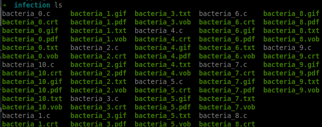
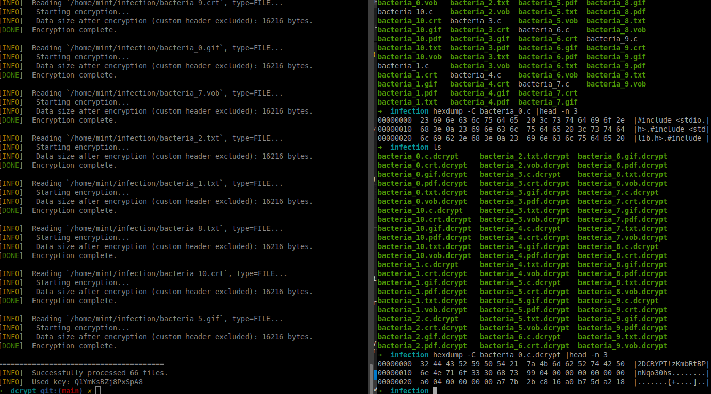

# **dcrypt**

## **Description**

dcrypt is a cross-platform file encryption/decryption tool that adds a custom header to encrypted files, storing essential metadata for decryption and management of the encrypted content.

### **Features**

- dcrypt only works in the specified directories inside `dcrypt.h`:
```c
# define DC_TARGET_PATHS { "/home/user/folder1", /home/user/folder2" } // No '/' at the end
```
- The list of the handled extensions by default can be found in `extensions.c`:

```c
const char *handled_extensions[] = {
    "der", "pfx", "key", "crt", "csr", "p12", "pem", "odt", "ott", "sxw", "stw", "uot",
    "3ds", "max", "3dm", "ods", "ots", "sxc", "stc", "dif", "slk", "wb2", "odp", "otp",
    "sxd", "std", "uop", "odg", "otg", "sxm", "mml", "lay", "lay6", "asc", "sqlite3",
    "sqlitedb", "sql", "accdb", "mdb", "db", "dbf", "odb", "frm", "myd", "myi", "ibd",
    "mdf", "ldf", "sln", "suo", "cs", "c", "cpp", "pas", "h", "asm", "js", "cmd", "bat",
    "ps1", "vbs", "vb", "pl", "dip", "dch", "sch", "brd", "jsp", "php", "asp", "rb",
    "java", "jar", "class", "sh", "mp3", "wav", "swf", "fla", "wmv", "mpg", "vob",
    "mpeg", "asf", "avi", "mov", "mp4", "3gp", "mkv", "3g2", "flv", "wma", "mid",
    "m3u", "m4u", "djvu", "svg", "ai", "psd", "nef", "tiff", "tif", "cgm", "raw",
    "gif", "png", "bmp", "jpg", "jpeg", "vcd", "iso", "backup", "zip", "rar", "7z",
    "gz", "tgz", "tar", "bak", "tbk", "bz2", "PAQ", "ARC", "aes", "gpg", "vmx", 
    "vmdk", "vdi", "sldm", "sldx", "sti", "sxi", "602", "hwp", "snt", "onetoc2", 
    "dwg", "pdf", "wk1", "wks", "123", "rtf", "csv", "txt", "vsdx", "vsd", "edb", 
    "eml", "msg", "ost", "pst", "potm", "potx", "ppam", "ppsx", "ppsm", "pps", 
    "pot", "pptm", "pptx", "ppt", "xltm", "xltx", "xlc", "xlm", "xlt", "xlw", 
    "xlsb", "xlsm", "xlsx", "xls", "dotx", "dotm", "dot", "docm", "docb", "docx", 
    "doc"
};
```

- The program will encrypt the contents of the files in these folders using an encryption key + a unique IV generated for each file.
- Files are encrypted with the AES-128 CBC algorithm.
- IVs are stored inside the headers of the encrypted files.
- The program renames all the files in the mentioned folders adding the ".dcrypt" extension.
- If they already have this extension, they will not be renamed.
- The key with which the files are encrypted have to be 16 characters long.
- The program will do the reverse operation using the encryption key in order to restore the files to their original state.

---

## Commands

```sh
# Compilation
make

# Usage:
./dcrypt [-h|-v|-s|-k <KEY>|-r <KEY>] 

 Options:
  -v, --version          Show version information
  -s, --silent           Run in silent mode (non-verbose)
  -k, --key <KEY>        Provide an encryption key
  -r, --reverse <KEY>    Decrypt using the provided decryption key
  -h, --help             Show this help message and exit
```

---

## Testing

```sh
# Cleans, create test folder with test files, compiles, then runs the program
make run

# Creates test files to the test folder
make quine

# Or if you want 30 files for each given extension
make quine n=30 ext="txt vob cpp crt"
```

## Screenshots

`make quine` creates test files with different extensions...



After the encryption, all files get the `.dcrypt` extension and the custom header at the beginning of the files.



---

## Technical aspects

### **Explanation of the dcrypt Header Structure:**

When dcrypt encrypts a file, it modifies the original content by adding a **custom header**. This header stores metadata needed to decrypt the file and manage encrypted content.

| **Offset**  | **Value**                              | **Description**                           |
|-------------|---------------------------------------|-------------------------------------------|
| **0x0000**  | `"2DCRYPT!"`                           | Magic value/signature to identify encrypted files. |
| **0x0008**  | **Initialization Vector used during AES encryption**     | Random IV is used during AES encryption and stored here in plaintext. |
| **0x0018**  | **Original file size**                 | The size of the original unencrypted file. Helps verify successful decryption. |
| **0x001C**  | **Encrypted file contents (AES-128 CBC)** | The actual **AES-128 CBC** encrypted content of the original file.

### **Data encryption**
dcrypt performs AES-128 CBC encryption in order to encrypt the data.

#### **Chaining**
In CBC mode, each plaintext block is XORed with the previous ciphertext block before being encrypted.<br />
This means that the encryption of each block depends on the previous block's ciphertext, which enhances security.

#### **IV (Initialization Vector)**
The IV is a random value used to ensure that identical plaintext blocks produce different ciphertexts.<br />
This prevents patterns from appearing in the encrypted data.
<br /><br />
- Without IV (= NULL IV) the process will be faster, but less secure.
- Identical plaintexts will produce identical ciphertexts.
- dcrypt uses the keygen mentionned below to create a unique IV for each fileg.
- The used IV is then saved on the custom header and is retrieved during decryption.

#### **Padding**

When using OpenSSL's EVP functions for encryption, the default padding scheme used is PKCS#7 padding.<br />
If the plaintext data is not a multiple of the block size (16 bytes for AES), PKCS#7 padding adds bytes to the end of the plaintext.

### **Key Generators**

#### Key length
- CryptoAPI from Windows generates AES keys that can contain non-printable characters. The key is essentially a binary blob of data, and it is not restricted to printable ASCII characters.

- This is why we use keys that are converted to hex strings, hence the 32B (16 x 2) size, as each byte of the key is expressed by two hex characters.

#### **Keygen for AES 128bit keys: /dev/urandom**
Our keygen function generates a random encryption key of a specified width using a given character set. It seeds the random number generator with /dev/urandom or /dev/random, and selects random characters from the character set to build the key.
<br /><br />

- Advantages of Using /dev/xrandom:

	- Cryptographic Security: /dev/xrandom is designed to provide
		cryptographically secure random numbers. It uses environmental
		noise collected from device drivers and other sources to generate		random numbers, making it much harder to predict the output.

	- Non-Deterministic: Unlike rand(), which is a pseudo-random number		generator (PRNG) that produces a deterministic sequence based on		an initial seed, /dev/xrandom generates non-deterministic random		numbers. This means that even if you read from it multiple times		in quick succession, you will get different values.

	- Higher Entropy: The randomness quality (entropy) of numbers generated		from /dev/xrandom is significantly higher than that of rand().	  This makes it suitable for applications that require high-quality		randomness, such as cryptographic keys, secure tokens, and other		security-sensitive operations.

- /dev/urandom or /dev/random:
  - Blocking Behavior: /dev/random is a blocking source of random numbers.
    This means that if there is not enough entropy (randomness) available
    in the system, reading from /dev/random will block (i.e., wait) until
    sufficient entropy is gathered.
    This can lead to delays in applications that require random numbers.
  - While it may not provide the same level of entropy as /dev/random,
    /dev/urandom is generally considered secure enough for most applications,
  	including cryptographic purposes. This is why we will use it here.

#### **Keygen for IV 128bit keys: current time (with nanosecond precision) based rand()**

- Generates an encryption key randomly with two different functions
	using different precision of the current time as seed.

  - charset: a set of characters that can be used for the key
  - strength: the width of the key

- Setting the seed for the random number generator used by rand()
	helps ensuring that the sequence of random numbers generated by rand()
	is different each time the program runs.

- The seed is set according to the current time, which makes it unique, but
	not perfectly:

	- Using srand(time(NULL)) seeds the random
		number generator with the current time in seconds.
	- This means that if you call srand(time(NULL)) multiple times within
   	the same second, you will get the same sequence of random numbers
 	because the seed value does not change.
 - Using clock_gettime(): This function can
		provide nanosecond precision, depending on the clock used. This will
 	improve the randomness of the key.

---

## Windows
To set up your development environment on Windows, you will need to install the following tools:

### Installation

#### GCC
- **Installation**: You need to install **MSYS2**. You can download it from [MSYS2's official website](https://www.msys2.org/).
- **Environment Setup**: After installing MSYS2, add the following path to your system's environment variables:
  ```
  C:\msys64\ucrt64\bin
  ```
- **Update Packages**: Open the MSYS2 terminal and run the following commands to update the package database and install GCC:
  ```bash
  pacman -Syu                     # Update the package database
  pacman -Su                      # Update installed packages
  pacman -S mingw-w64-x86_64-gcc  # Install GCC for 64-bit
  ```

#### Make
- **Installation**: You need to install **GNUWin32**. You can download it from [GnuWin32's official website](http://gnuwin32.sourceforge.net/).
- **Environment Setup**: After installing GNUWin32, add the following path to your system's environment variables:
  ```
  C:\Program Files (x86)\GnuWin32\bin
  ```

### CRLF
- When you open a file normally:
```
    outfilefd = open(target_path, O_CREAT | O_RDWR | O_TRUNC, 0755);
```
Windows automatically translates line endings (`\r\n` and `\n`) and messes things up.

- Unless you explicitly tell it "binary mode", Windows thinks you are reading a "text file" and tries to be smart (but actually breaks binary data).

- This is why we have to use the `O_BINARY` flag:
```
    outfilefd = open(target_path, O_CREAT | O_RDWR | O_TRUNC | O_BINARY, 0755);
```
- On Linux, no such translation exists. 

## Useful commands
```powershell
# Get file in hexidecimal notation and only print the first 3 lines
Format-Hex .\sample.txt.dcrypt | Select-Object -First 3
# Equivalent on Unix
hexdump -C ./sample.txt.dcrypt | head -n 3
```